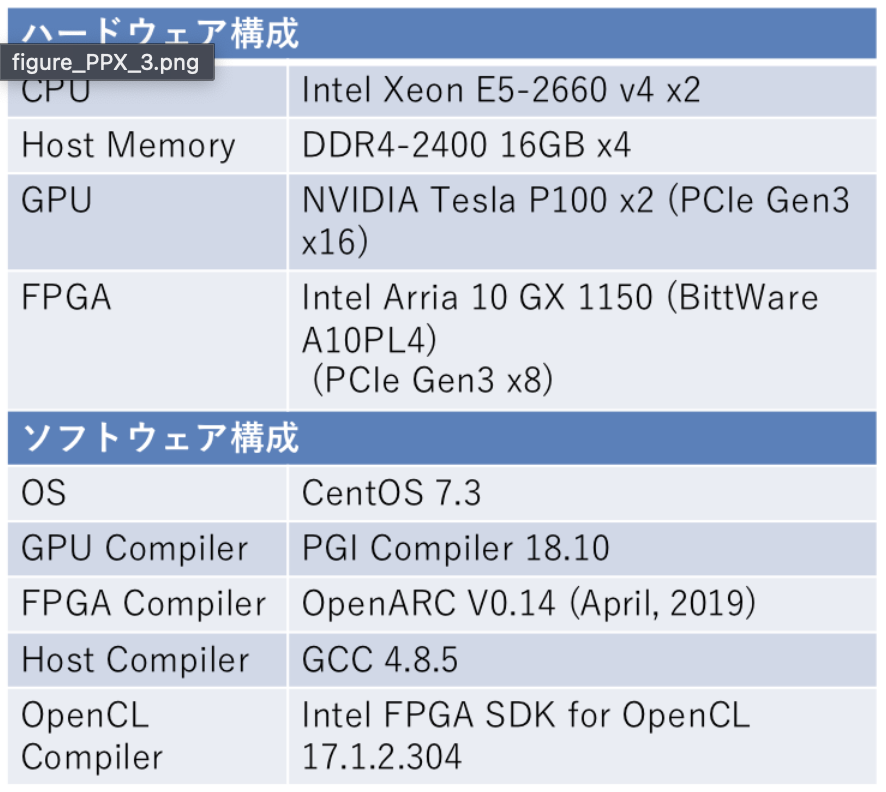

## 目次

- [HPC\_Note1](#hpc_note1)
  - [1.演算性能](#1演算性能)
  - [2.並行処理と並行処理](#2並行処理と並行処理)
    - [並行処理](#並行処理)
    - [並列処理](#並列処理)
  - [3.Flynnの分類](#3flynnの分類)
    - [SISD (Single Instrution stream Single Datastream)](#sisd-single-instrution-stream-single-datastream)
    - [SIMD(Single Instruction stream Multiple Datastream)](#simdsingle-instruction-stream-multiple-datastream)
    - [MISD(Multiple Instruction stream Single Datastream)](#misdmultiple-instruction-stream-single-datastream)
    - [MIMD(Multiple Instruction stream Multiple Datastream)](#mimdmultiple-instruction-stream-multiple-datastream)
    - [欠点](#欠点)
  - [4.並列処理アーキテクチャ](#4並列処理アーキテクチャ)
  - [5.分散メモリ型並列計算機](#5分散メモリ型並列計算機)
    - [分散メモリ型並列計算機の仕組み](#分散メモリ型並列計算機の仕組み)
    - [クラスタとMPP](#クラスタとmpp)
  - [6.共有メモリ型並列計算機](#6共有メモリ型並列計算機)
    - [並列メモリ型並列計算機の仕組み](#並列メモリ型並列計算機の仕組み)
  - [7.共有メモリ計算機アーキテクチャ](#7共有メモリ計算機アーキテクチャ)
    - [SMP (Symmetric Multi Processor)](#smp-symmetric-multi-processor)
    - [NUMA (Non-Uniformed Memory Access)](#numa-non-uniformed-memory-access)
    - [UMA (Uniform Memory Access model)](#uma-uniform-memory-access-model)
    - [分散共有ハイブリッド](#分散共有ハイブリッド)
  - [8.命令セットアーキテクチャ](#8命令セットアーキテクチャ)
    - [CISC (Complex Instruction Set Computer)](#cisc-complex-instruction-set-computer)
    - [RISC (Reduced Instruction Set Computer)](#risc-reduced-instruction-set-computer)
    - [GPU向けアーキテクチャ](#gpu向けアーキテクチャ)
    - [命令セットの具体例](#命令セットの具体例)
  - [9.ネットワークの構成要素](#9ネットワークの構成要素)
    - [並列計算に用いられるネットワーク](#並列計算に用いられるネットワーク)
    - [トポロジー](#トポロジー)
    - [InifiniBand](#inifiniband)
    - [通信の帯域とレイテンシ](#通信の帯域とレイテンシ)
    - [DMA(Direct Memory Access)](#dmadirect-memory-access)
    - [非同期通信](#非同期通信)


# HPC_Note1

僕がHigh Performance Computingに関するメモを残し後から体系的に学ぶための場所

## 1.演算性能

- 演算性能：FLOPS
  - FLOP : Floating point Operatyions は浮動小数点演算数
- 通信性能：B/s
  - 必ずしも1B=8bitではないことに注意

## 2.並行処理と並行処理

### 並行処理
  - 並行処理(Concurrent Processing)とは、複数の処理が時間的に重なりながら実行されることをさす。具体的には、物理的に同時に実行されるわけではなく、複数の処理が交互に進行することによってユーザには「同時に時移行されているように見える」という特徴がある。
  
  - 特徴:
    - 物理的な同時実行：並行処理では、複数のタスクが「時間的に重なる」形で実行されるが、必ずしも物理的に同時に動作するわけではない。シングルコアのプロセッサでも並行処理は可能で、タスクの切り替えが行われる（Context Switch）。
    - 高速化が目的：並列処理の主な目的は、大規模な計算や処理を高速に終えることである。計算処理やデータ処理を小さな単位に分割して、複数のプロセッサで一斉に実行することで、全体の処理時間を大幅に短縮できる。
  
  - 例：Webサーバ: 同時に複数のクライアントからのリクエストを処理する場合、リクエストが物理的に同時に処理されるわけではなく、スレッドやプロセスが切り替わりながら、ユーザーには同時にリクエストが処理されているように見える。
  
### 並列処理

  - [並列処理(Parallel Processing)](#4並列処理アーキテクチャ)とは、複数の処理が物理的に同時に実行されることを指す。これは、複数のプロセッサやCPUコアを利用して、タスクを本当に同時進行で処理する仕組みである。処理が「同時に走っている」ことが実際にハードウェア的に実現される。
  
  - 特徴：
    - 物理的な同時実行：並列処理では、複数の処理が同じ時間に実行されている。これは、マルチコアCPUや複数のプロセッサがある環境で可能。すべてのタスクが同時に処理されるため、処理時間の短縮が期待できる。
    - 高速化が目的：並列処理では、大規模な計算や処理を高速に終えることである。計算処理やデータ処理を小さな単位に分割して、複数のプロセッサーで一斉に実行することで、全体の処理時間を大幅に短縮できる。
    - ハードウェア依存：並列処理を効果的に行うには、ハードウェアの支援が不可欠。たとえば、マルチコアCPUやGPU、スーパーコンピュータなどが必要になる。

  - 例：科学技術計算・シミュレーション: スーパーコンピュータ「富岳」では、気象予測や分子構造解析などの複雑な計算を、何百万ものコアで分散実行することで短時間で処理する。

## 3.Flynnの分類

- 命令流(Instruction Stream)の数とデータ流(Data Stream)の数に着目し、コンピュータを以下の4つの方式に分類する。

### SISD (Single Instrution stream Single Datastream)

- 命令流もデータ流も1つ。基本的なコンピュータの方式で、ユニプロセッサと呼ぶこともある。

### SIMD(Single Instruction stream Multiple Datastream)

- 1つの命令流で多数のデータを処理する方式。コントローラは命令を命令メモリから取ってきて、多数のプロセッサがそれぞれのデータに対して同じ処理を行うように指示する。データレベル並列性を簡単に利用することができるためGPUなどの計算加速装置(アクセラレータ)で用いられる。一般的なIntelのコンピュータにもこれと同じ考え方の命令(マルチメディア命令)が装備されている。


### MISD(Multiple Instruction stream Single Datastream)

- 命令流が一つなのにデータ流が単数というのは考えにくいため通常はこの形のコンピュータは存在しないと考えられている。アナログコンピュータやパイプライン処理がこれにあたる。

### MIMD(Multiple Instruction stream Multiple Datastream)

- 複数命令流、複数データ流の方式。それぞれのプロセッサが独自に命令を取ってきて独立にデータを処理する。協調作業を行うには動機を取ってデータを交換する必要がある。現在、ノートPC、スマートフォン、サーバ、データセンターで動作している並列コンピュータのうちほとんどはここに分類される。

### 欠点
- Flynnの分類はその簡単さにより現在でも使われているが、MIMDの枠が広すぎて並列コンピュータの分類としては機能しない。そこで1970年代のオペレーションシステム研究者を中心に[共有メモリ](#7共有メモリ計算機アーキテクチャ)に注目した分類が提唱された。

## 4.並列処理アーキテクチャ

  - [分散メモリアーキテクチャ(Distributed memory system)](#5分散メモリ型並列計算機)；各プロセスは明示的にデータを交換(送受信)しあう。各プロセッサは独自のメモリ(他プロセッサからはアクセス不可能)をも相互結合もうを用いたメッセージパッシングによってデータ交換を行う。
    - Massage passing(send, receive,...)
  - [共有メモリアーキテクチャ(Shared memory syatem)](#6共有メモリ型並列計算機)；各プロセスは共有するメモリのデータを読み書きで通信しあう。並列プロセッサ間で物理的に共有されるメモリを持ち各プロセッサがload/store命令を発行してデータの読み書きを行う。アーキテクチャのタイプとして[SMP](#smp-symmetric-multi-processor)と[NUMA](#numa-non-uniformed-memory-access)がある。
    - Shared mamory access(write, read,...)
  - hybrid型システム(constellation型)：共有メモリシステムを分散メモリシステムに結合している。

## 5.分散メモリ型並列計算機

### 分散メモリ型並列計算機の仕組み

  - CPUとメモリという一つの計算機システム(ノード)がネットワークで結合されているシステム
  - それぞれの計算機で実行されているプログラムはネットワークを通じてデータ(メッセージ)を交換し、動作する。
  - 比較的簡単に構築可能・拡張性(Scalability)が高い
    - 超並列計算機(MPP：Massively Parallel Processing)：1980年代後半から多数登場したが一部を除き消滅しつつある。(富岳はMPPシステム)
    - クラスタ型計算機；
  - 基本的にCPU+memory(+I/0)という逐次計算機構成を何らかのネットワーク(専用or汎用)で結合しているためハードウェア的にシンプル
  - プログラム上の明示的なMassage passingで通信を行うためユーザプログラミングは面倒
    - MPI(Massage Passing Interface)のような標準的なツールが提供されている。
    - domain decomopositionのような単純なデータ配列やmaster/worker型の処理は比較的容易に記述可能
  - 1980年代からMPPの典型的な実装として登場。現在はPCクラスタの基本的なアーキテクチャになっている。


### クラスタとMPP

| 特徴   | クラスタ(Cluster) | MPP(Massively Parallel Processing)  |
|--------|------|--------|
| ノード構成   | 商用コンピュータやサーバがネットワく接続   | 専用の高性能ノードで構成されたシステム |
| 通信方式  | 通常は標準的なネットワーク(Ethernet)   | 高速インターコネクト(InfiniBandなど) |
| スケーラビリティ   | 高いが、ネットワークの帯域が制約になることも   | 非常に高いスケーラビリティ   |
| 並列処理の種類   |分散メモリモデル、タスク並列処理   | データ並列処理、大規模な並列処理が可能   |
| 用途   | 一般的な並列処理、サーバ用途   | 科学技術計算、大規模趣味レーション   |

## 6.共有メモリ型並列計算機

### 並列メモリ型並列計算機の仕組み

- それぞれのCPUで実行されているプログラム(スレッド)はメモリ上のデータにお互いにアクセスすることでデータを交換し動作する。
- アーキテクチャはさらにSMPとNUMAに分かれる。
- ハードウェアによる共有メモリの提供によりユーザにとってアプリケーションが非常に書きやすい。
  - multithreadプログラミング環境(POSIX thread)
  - OpenMP (共有メモリを前提とした簡易並列記述システム)
  - Automatic Parallelization(copiler does it for you)
- メモリという極めてPrivateな構成要素を共通化しているため性能を上げるには多くのハードウェア、アーキテクチャ的な工夫が必要
- 多数のプロセッサが一つのメモリ要素をアクセスする状況が簡易に記述できて極端なボトルネックを生じやすい。
  - システムのScalabilityの確保が困難


## 7.共有メモリ計算機アーキテクチャ

### SMP (Symmetric Multi Processor)

- 各プロセッサから見てどのmemory module への距離も等しい
- 構成としては複数のプロセッサが共通のバスを経由して等しくmemory module に接続されている。
- 大規模システムとしてはHPC2500シリーズ、日立SR16000シリーズ等が該当する
- Coherent chacheとの併用が一般的
- トラフィックが集中した時に性能低下が防げない


### NUMA (Non-Uniformed Memory Access)

- CPUに対して固有のmemory moduleがあり共有バスまたはスイッチを介して他のCPUのmoduleも直接アクセス可能
- 遠距離のmemory moduleへのアクセスには時間がかかる。(non-symmetric)
- コモディティスカラプロセッサとしてはAMD(Opteron)が最初に方式を取り入れた。
  - 今では標準になっている。
- 大規模システムではもう存在しない。(NUMAはCPUボード上のみ)
  


### UMA (Uniform Memory Access model)

- どのプロセッサから見ても同じ時間で読み書きできる共有メモリを持つ方式。典型的なUMAは共有バスやスイッチで複数のプロセッサが単一のメモリを共有する方式で、集中メモリ型と呼ばれる。メモリへのアクセスが集中するため、プロセッサ数を増やすことができないが実現のためのコストが小さいため、ノートPC、デスクトップPC、スマートフォンなどに使われている多くの小規模並列コンピュータがこの分類に入る。

- UMAとSMPの違い

| 観点   | UMA | SMP  |
|--------|------|--------|
| 対象   | メモリアーキテクチャ   | CPUの動作方式 |
| アクセス特性  | メモリへのアクセスが均一   | CPUは全て対等に動作 |
| メモリの種類   | 共有メモリ   | 共有メモリ(通常UMAを使う)   |
|　よく使われる場面   | UMA構成のSMPシステム   | OSやサーバなどのマルチコア対応環境    |

### 分散共有ハイブリッド

- 共通メモリと分散メモリの組み合わせ
- 分散メモリ型システムの各ノードがそれ自身共有メモリアーキテクチャになっている。(SMP or NUMA)
- マイクロプロセッサ自体が1チップで共有メモリ構成(マルチコア)となっていることが大きな要因、近年のマルチプロセッサ普及により急激に主流となった。


## 8.命令セットアーキテクチャ

- 命令セットアーキテクチャ(ISA : Instruction Set Architecture)はコンピュータのCPUやGPUが理解し、実行する命令のセットを定義するプロトコルのこと。ISAはソフトウェア(Operating SystemやApplication program)とハードウェア(CPU, GPU)間のインターフェースを提供する。ISAがどのような命令をサポートしているかによってCPUの性能、ソフトウェアの効率、開発の容易さなどが大きく影響を受ける。

### CISC (Complex Instruction Set Computer)
- 特徴：複雑な命令を一つの命令で実行できるように設計されたアーキテクチャ。一つの命令で複数のオペレーションを実行することができ、コードの密度が高くなる場合がある。
- 具体例；x86, x86-64(intel), MIPS(初期バージョン)
  
### RISC (Reduced Instruction Set Computer)
- 特徴：シンプルで高速な命令セットを持つアーキテクチャ。命令が少なく単純で1クロックで複数実行できる。RISCアーキテクチャでは複雑な命令を単純な命令に分解することが多いです。
- 具体例：ARM, MIPS(後期バージョン), SPARC, PowerPC

### GPU向けアーキテクチャ
- CUDA(NVIDIA)やOpenCLなど並列計算に特化した命令セットを提供する。

### 命令セットの具体例
- x86とARMはISAの一部で具体例であり、CISCやRISCは設計哲学。x86はCISCで作られたISAの具体例でARMはRISCで作られたISAの具体例。
- これまで、ISAは「x86系」が圧倒的なソフトウェア資産を背景に市場シェアを伸ばしてきたが、スマートフォンの普及に伴ってモバイル分野を制した「ARM v-」は全体の出荷量で「x86系」を大幅に超える規模までに成長した。近年はオープンソースのISA「RISC-V」が注目されている。次なる大きな市場はIoT分野だと考えられていてライセンスフリーの「RISC-V」が猛威を振るうのではないかという予想も立てられている。

参考文献：https://ipsj-catalog.jp/glossary/parlance/18.html


## 9.ネットワークの構成要素

### 並列計算に用いられるネットワーク

- 異なるmemory moduleは自由に触れない
- 並列計算ではネットワークの性能が非常に重要になる。
- 通信は計算の本質的な要素ではない。したがって可能な限り通信にかかる時間を短くしたい。


### トポロジー


### InifiniBand

- 高性能な汎用通信網の一つ


### 通信の帯域とレイテンシ

- 帯域(Byte/s)：1秒あたりの通信できる通信量
- レイテンシ(s)：送信側が送信して受信側に届くまでの時間、通信遅延


- 通信はできるだけまとめて行い、回数を減らした方が良い。


### DMA(Direct Memory Access)

- 高性能なネットワークでは通信アダプタがCPUメモリに直接アクセスできるものがある。このように外部デバイスがCPUメモリに直接アクセスすることをDMAと呼ぶ。
- データ転送中にCPUの介入が不要なため高性能、CPUが自由になるための他の計算を行える。


### 非同期通信

- CPUにとって通信はかなりの時間がかかる作業である。通信が終わるまでCPUが何もしないのでは無駄が大きい。
- 計算を行っている間に通信を行う。→非同期通信
- 効果は大きいがプログラミングは複雑になる。


## 10.物理コアと論理コア

| 種類   | 説明 |
|--------|------|
| 物理コア   | 実際にCPUチップ内に存在する「処理の心臓部」そのもの（物理的なユニット）   |
| 論理コア  | OSから見える処理単位。物理コアが仮想的に「2つに見える」こともある（＝ハイパースレッディング）  |

-  Intel Corei7などのCPUには
   - 物理コア：4つ
   - 論理コア：8つという構成が多い。これは各物理コアがHyper-Threadingにより二つの論理コアに見えるから。
-  M1pro-chipでは
  - 物理コア：8つ
   - 論理コア：8つ

- CCSのPre-PACS versionXの環境

```
Architecture:          x86_64
CPU op-mode(s):        32-bit, 64-bit
Byte Order:            Little Endian
CPU(s):                56
On-line CPU(s) list:   0-55
Thread(s) per core:    2
Core(s) per socket:    14
Socket(s):             2
NUMA node(s):          2
Vendor ID:             GenuineIntel
CPU family:            6
Model:                 79
Model name:            Intel(R) Xeon(R) CPU E5-2660 v4 @ 2.00GHz
Stepping:              1
CPU MHz:               2400.634
CPU max MHz:           3200.0000
CPU min MHz:           1200.0000
BogoMIPS:              4000.27
Virtualization:        VT-x
L1d cache:             32K
L1i cache:             32K
L2 cache:              256K
L3 cache:              35840K
NUMA node0 CPU(s):     0-13,28-41
NUMA node1 CPU(s):     14-27,42-55
```


- ソケット2つの28coreCPUで2threadのクラスタ
  
